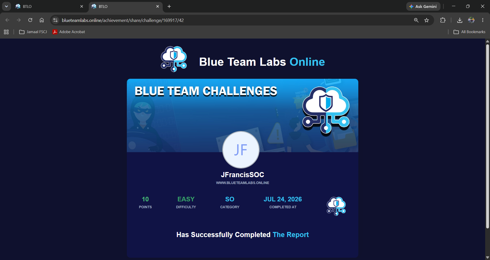

# 🛡️ BTLO-01: The Report


## Overview

This repository contains my completed Blue Team Labs Online challenge, **The Report**.

For this challenge, I had to review a threat intelligence report and find information about vulnerabilities, ransomware activity, attacker behavior, initial access methods, and security recommendations.

I also had to make sure I verified the information in the report before submitting my answers.

> **Note:** I am not including challenge answers or a full walkthrough. This repository only shows what I worked on, what I learned, and the skills I practiced.

---

## Challenge Information

| Field | Information |
|:------|:------------|
| Platform | Blue Team Labs Online |
| Challenge | The Report |
| Category | Security Operations |
| Difficulty | Easy |
| Points Earned | 10 |
| Status | ✅ Completed |
| Completion Date | July 24, 2026 |

---

## Skills I Practiced

- Reading threat intelligence reports
- Finding important information in large reports
- Researching vulnerabilities and CVEs
- Identifying attacker groups and malware
- Understanding ransomware activity
- Reviewing initial access methods
- Finding defensive recommendations
- Verifying information before making a conclusion
- Documenting what I learned

---

## Topics Covered

- Threat Intelligence
- Vulnerability Management
- Exchange Server Vulnerabilities
- Ransomware Groups
- Affiliate-Based Ransomware Activity
- Initial Access
- SEO Poisoning
- Coin Miner Activity
- Detection Opportunities
- Defensive Security Controls

---

## How I Worked Through the Challenge

1. Read the question carefully.
2. Used the report table of contents to find the right section.
3. Searched for the exact keyword or topic.
4. Read the full section instead of only looking at one sentence.
5. Verified names, CVEs, processes, and security recommendations.
6. Submitted the answer only after checking the source.
7. Recorded the main lessons I learned from the challenge.

---

## What I Learned

This challenge showed me that threat reports are more than just long security documents.

They can help analysts understand:

- How attackers gain access
- What vulnerabilities are being used
- What malware or ransomware groups are involved
- What activity to look for
- What security controls can help reduce risk

I also learned that small wording differences matter. A related answer is not always the exact answer a challenge is asking for, so checking the original source is important.

---

## Tools and Resources

- Blue Team Labs Online
- Red Canary Threat Detection Report
- MITRE ATT&CK
- Browser search
- Personal investigation notes

---

## Challenge Completion



---

## Repository Structure

```text
BTLO-01-The-Report
│
├── README.md
└── Screenshots
    └── 01-BTLO-The-Report-Completion.png
```

---

## Lessons Learned

This challenge improved my ability to read a large security report, find the right information, and confirm my findings before making a decision.

The biggest lesson for me was to avoid relying on memory or guessing.

For future labs, I will:

- Search the exact topic
- Read the surrounding section
- Verify the answer from the source
- Check the requested format
- Keep notes on what I learned

---

## Why This Matters for SOC Work

SOC analysts have to review alerts, security reports, CVEs, threat intelligence, and vendor research.

This challenge helped me practice:

- Security research
- Threat intelligence analysis
- Vulnerability awareness
- Ransomware research
- Defensive thinking
- Clear documentation

---

## Continuous Learning

I am continuing to build hands-on experience through:

- Blue Team Labs Online
- SOC investigation case files
- Microsoft Sentinel
- Splunk
- Wireshark
- KQL
- MITRE ATT&CK

---

## Connect With Me

**LinkedIn:**  
https://www.linkedin.com/in/jfrancissoc
